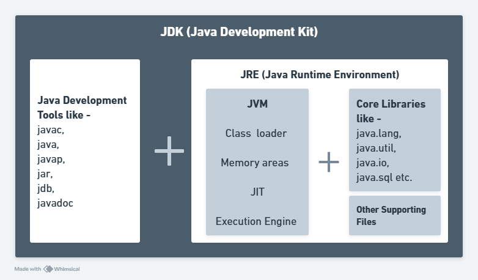
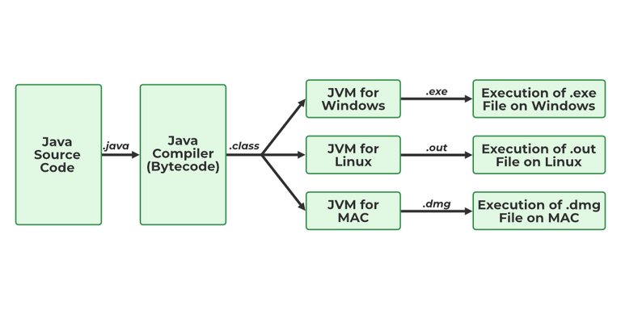

## Most Important Core Java Interview Questions

#### **1. What are the features of java 8, 11, 17 and 21 ?**

| Java Version | Key Features |
|-------------|-------------|
| **Java 8 (2014)** | - Lambda Expressions and Functional Interfaces  |
|             | - Streams API for functional-style operations on collections |
|             | - Default and Static Methods in Interfaces |
|             | - New Date and Time API (`java.time` package) |
|             | - Optional Class for Handling Nulls |
|             | - Nashorn JavaScript Engine |
|             | - Collectors and Improvements in `java.util.function` |
|             | - `CompletableFuture` for Asynchronous Programming |
| **Java 11 (2018) (LTS)** | - `var` for Lambda Parameters |
|             | - HTTP Client API (Standard) |
|             | - New String Methods (`isBlank()`, `lines()`, `strip()`, etc.) |
|             | - `Files.readString()` and `Files.writeString()` Methods |
|             | - Running Java Files Without Compilation (`java MyProgram.java`) |
|             | - Garbage Collector (Epsilon and ZGC Introduced) |
|             | - Removal of Java EE and CORBA Modules |
| **Java 17 (2021) (LTS)** | - Sealed Classes (`sealed`, `permits` keyword) |
|             | - Pattern Matching for `switch` (Preview) |
|             | - Strongly Encapsulated JDK Internals |
|             | - New macOS Rendering Pipeline |
|             | - Foreign Function & Memory API (Incubator) |
|             | - New Random Number Generator API |
|             | - Deprecation of `SecurityManager` |
| **Java 21 (2023) (LTS)** | - Virtual Threads (Project Loom) for Lightweight Concurrency |
|             | - Sequenced Collections API (`SequencedSet`, `SequencedMap`) |
|             | - Record Patterns (Finalized) |
|             | - Unnamed Classes and Instance `main()` Methods (Preview) |
|             | - String Templates (Preview) |
|             | - Scoped Values for Thread-local Variables |
|             | - Structured Concurrency API |
|             | - Key GC Improvements (ZGC and G1) |

#### **2. What is JDK, JRE and JVM? What is the difference between them?**

**What is JDK?**
- JDK stands for Java Development Kit. 
- JDK is a complete software development kit that provides everything needed to develop, compile, debug, and run Java applications.
- It includes the JRE (to run Java programs) and development tools (like compiler, debugger, and libraries).
- It allows the packaging of Java applications using jar (Java Archive).
- Developers must install JDK to write and run Java programs.
- JVM, JRE, and JDK are platform dependent because the configuration of each OS is different from each other. 

**Components of JDK:**
- `JRE (Java Runtime Environment)` - To run Java applications.
- `Java Compiler (javac)` - Converts Java code into bytecode.
- `Java Debugger (jdb)` - Helps debug Java programs.
- `Java Archive Tool (jar)` - Used to create JAR files.
- `Java Documentation Tool (javadoc)` - Generates documentation.
- `Additional Tools` - For monitoring, security, and management.

          

**What is JRE?**
- JRE stands for Java Runtime Environment.
- The JRE includes everything needed to run Java applications.
- JRE is used only for running Java programs, not for development.
- It includes JVM (Java Virtual Machine) to execute Java bytecode.
- If you only need to run Java applications, JRE is sufficient.
- JRE = JVM + Core Java Libraries + Native Libraries + Config Files

**Components of JRE:**
- `JVM (Java Virtual Machine)` - Executes Java bytecode.
- `Core Libraries` - java.lang, java.util, java.io, Collections, File handling, Networking, etc.
- `Native Libraries` - JRE includes native libraries (like .dll, .so, .dylib) that help JVM interact with the operating system.
- `Supporting Files` - Configuration files for execution.

**What is JVM?** 
- JVM Stands for Java Virtual Machine?
- It is called a virtual machine because it doesn't physically exist.
- It is responsible for converting Java bytecode into machine-specific code and executing it.
- It use Just-In-Time (JIT) compilation for optimized execution.
- It manages memory allocation and garbage collection automatically.
- It provides runtime security by preventing unauthorized memory access.
- JVM follows the WORA (Write Once, Run Anywhere) principle.
- JVM is platform-dependent (because every OS has a different JVM implementation).
- JVM makes Java platform-independent (because Java programs run on any OS with the appropriate JVM).
- JVM = Class Loader + Memory Areas + Execution Engine + Native Interface

       

**Components of JVM:**
- `Class Loader` - Loads .class files into memory.
- `Runtime Memory Areas` - JVM allocates memory dynamically into different sections:    
    | Memory Area | Description |
    |-------------|-------------|
    | Method Area |	Stores class metadata, static variables, and method code.|
    | Heap Area   |	Stores objects and instance variables (Shared among threads). |
    | Stack Area  |	Stores method call information (Local variables, return addresses). |
    | PC Register |	Stores the address of the next bytecode instruction to execute. |
    | Native Method Stack |	Stores data for native methods (written in C, C++). |

- `Execution Engine` - Converts bytecode into native code (machine-level).
- `Garbage Collector (GC)` - Manages memory automatically.
- `Security Manager` - Ensures Java application security
- `JIT Compiler (Just-In-Time Compiler)` - Mostly written in C++ for optimizing bytecode execution.
- `Native Interface (JNI & Native Libraries)` - Allows JVM to interact with native OS libraries (.dll, .so).    

**How JVM works or Architecture of JVM?**

1. What is String, StringBuffer and StringBuilder classes ? Explain when thay are introduced in Java ? Explain what are the difference between them ? 

